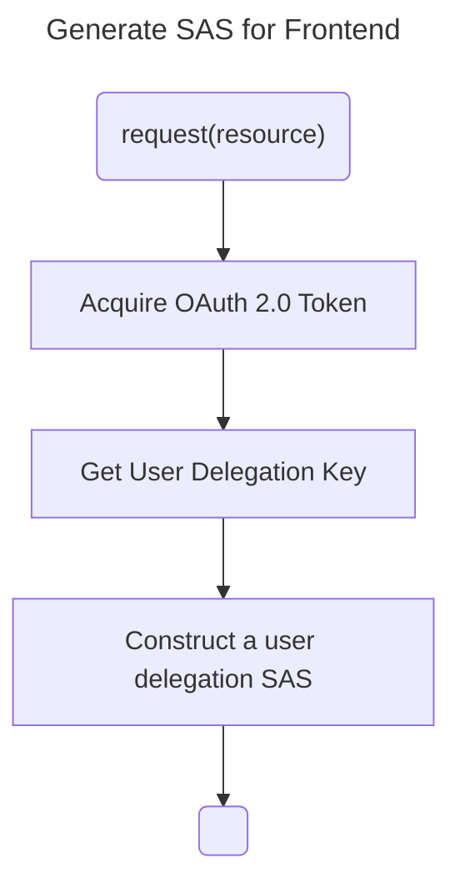
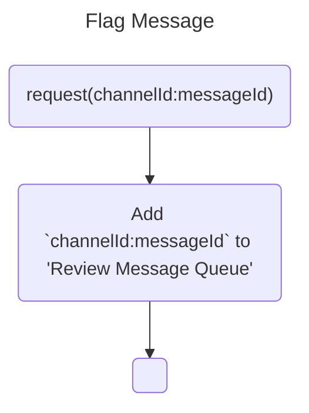

# Api Design

The `api` directory will mostly contain code for generating a sas token which can be used to query Blob Contents.

## Decisions

**Cloudflare Worker**: Choosing Cloudflare worker due to ability to to avoid cold starts, and pricing looked to be the best overall. Limitations means functionality is limited to the quasi-node environment provided by Cloudflare. Will develop the app in typescript, in addition to the features listed below will also need to verify messages actually came from discord.

**Azure Blob Storage**: Will use Azure Blob storage, and Queues to support bot operations, since it had the lowest pricing, after incorporating transfer fees.

### Generate SAS

**Assumptions:**

1. Microsoft Entra ID (OAuth App): will only be able to read
   - How to [Construct a user delegation SAS](https://learn.microsoft.com/en-us/rest/api/storageservices/create-user-delegation-sas#construct-a-user-delegation-sas)

### Flag Message

Flagged messages will be reviewed for edits or deletion.

