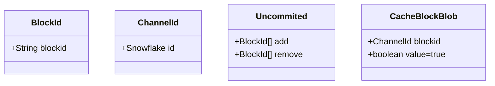
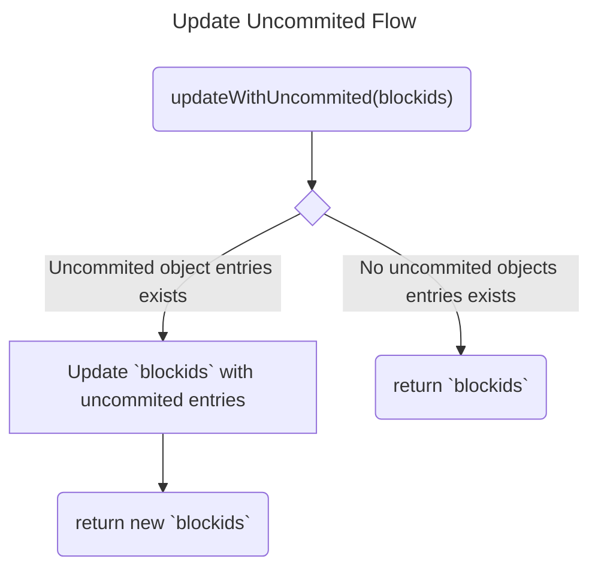
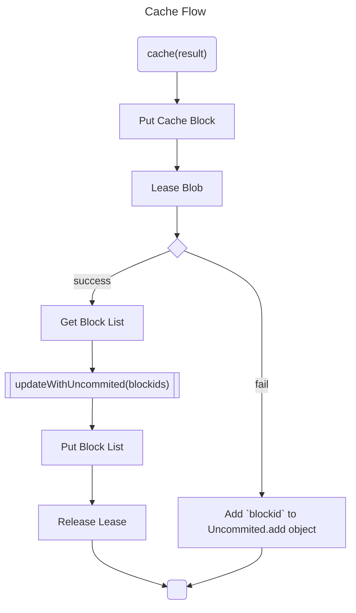
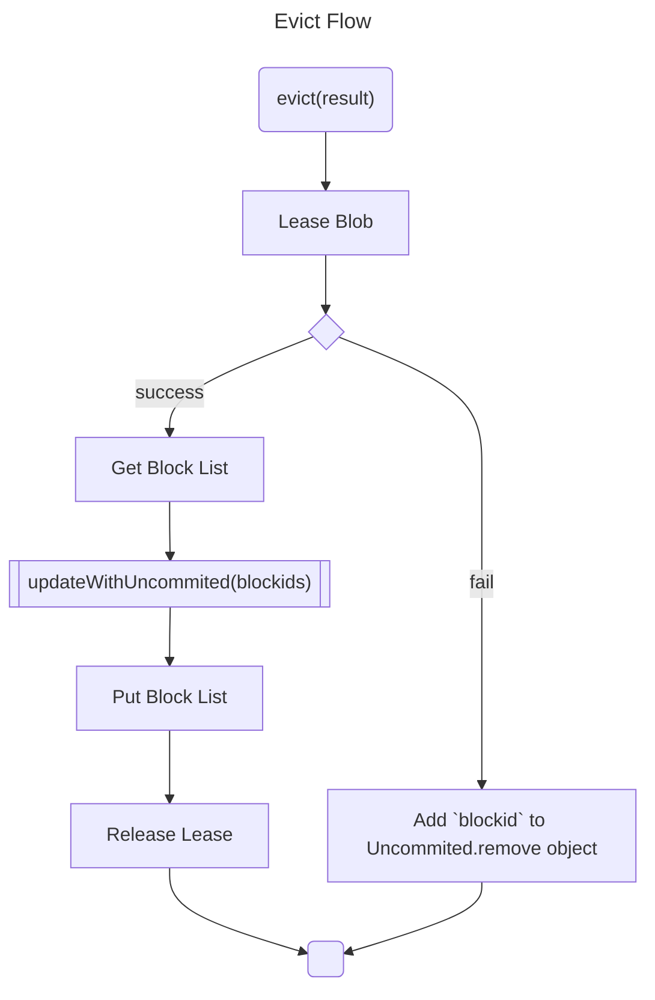
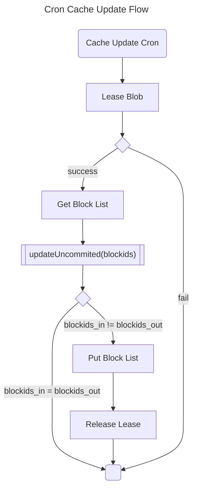
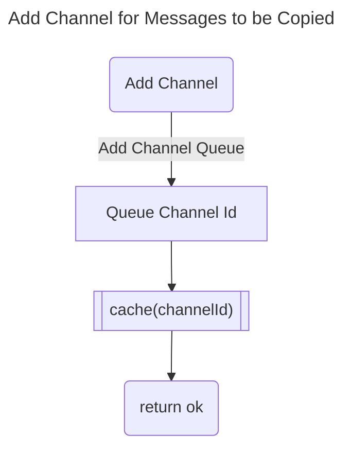
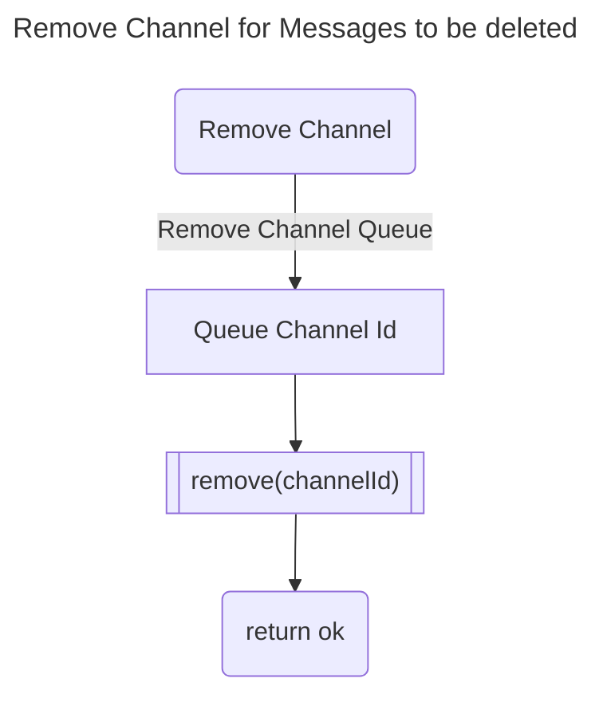
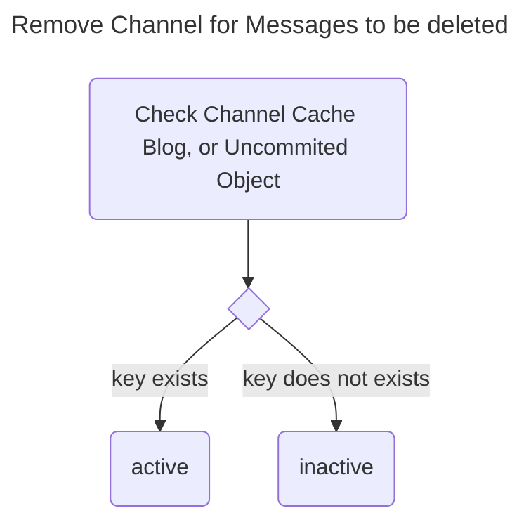

# Bot Design

The `bot` directory will contain all the related code for discord app portion of discord-mirror.

## Decisions

**Cloudflare Worker**: Choosing Cloudflare worker due to ability to to avoid cold starts, and pricing looked to be the best overall. Limitations means functionality is limited to the quasi-node environment provided by Cloudflare. Will develop the app in typescript, in addition to the features listed below will also need to verify messages actually came from discord via signature check.

**Azure Blob Storage**: Will use Azure BlockBlob and Queue storage to support bot operations, since it had the lowest pricing, after incorporating transfer fees.

### Blob Storage Flow for Simple Caching

Not shown is Cache BlockBlob intialization. Will be set with a tag `HotTier` for `StorageTierWorker`.

### Ability to Add Channel

Adds a channel id to a queue to be processed by the worker, which will eventually allow for messages to be copied from this channel.

### Ability to Remove Channel

Removing a channel will also delete all the messages. This might need to be revised depending on the costs of compute to re-add the messages vs. the cost of storing the messages, and marking them deleted.

### Return Channel Status

Returns the channel's status

