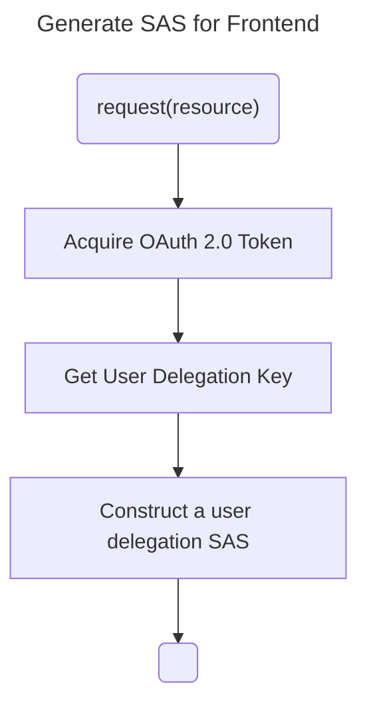
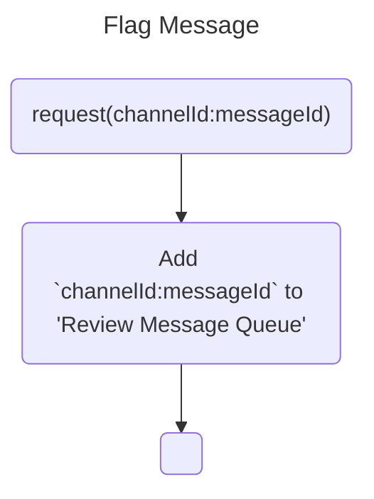

# Bot Design

The `web` directory will mostly contain code for the static web app.

## Decisions

**React**: Will use react due to comfort with the technology, and this project learnings objective were more in the worker class and data structure required to use a Block Blob data store.

**Azure Static Web App**: Since the project is already using the Azure stack will host with Azure, plus comes with free SSL, and hosting.

**avro-js & browserify**: Responses returned from `Query Blob Contents` are returning as avro, calling out the packages to use so that I remember: https://www.npmjs.com/package/avro-js

**tailwings css**: Plan to use tailwinds css to simplify style development, may need some help in this area.

**Google Adsense**: To help cover the hosting costs will include an ad block.

### Generate SAS

**Assumptions:**

1. Microsoft Entra ID (OAuth App): will only be able to read
   - How to [Construct a user delegation SAS](https://learn.microsoft.com/en-us/rest/api/storageservices/create-user-delegation-sas#construct-a-user-delegation-sas)

### Flag Message

Flag messages will be reviewed for edits or deletion.

