# Worker Design

The `worker` directory will contain code related to compute intensive operations to be performed by the application, and incorporated into a workflow.

## Decisions

**Temporal Typescript SDK**: will be used to coordinate work related to copying messages from activated channels. Planning to have each worker reference it's own sqlite db file, rather then a centralized server. Need to figure out archiving.

**Azure Blob Storage**: Will use Azure Block Blobs and Queues as storage to support worker operations, since it had the lowest pricing, and the ability to set differant tiers for blob storage.

**Github Actions**: Since all workflows could be performed asynchronously we'll leverage github actions to run an instance of the temporal service, and differant workers to perform tasks.

**Rate Limit Considerations**:

- Discord App has a global rate limit of 50 requests per second
- Github Actions allows for 20 concurrent jobs to be run at a time on the free account.
- Azure Block Blob's are limited to 50,000 Blocks

### Reusable Logic for Range Queries and Block Blob Distributed Hash Table

**Assumptions:**

1. Range query represent blobs where the blockid is a timestamp, and content represents where to find the appropriate Distributed Hash Table:

   1. `blockids` will be sorted by timestamp
   2. Parent Blobs will be included as a Blob Tag

1. Distributed Hash Table where the blockid is a SnowFlakeId and block contains the contents(value) related to the id
1. `getBlockList`: Can return two types of Block Ids formats:
   1. 41 bit timestamps based on [SnowFlakeId](https://en.wikipedia.org/wiki/Snowflake_ID) for Index Blobs
   1. SnowFlakeId for a Distributed Hash Table
1. `Expression` respresents a [Query acceleration: SQL language reference](https://learn.microsoft.com/en-us/azure/storage/blobs/query-acceleration-sql-reference)
1. Using JSON (instead of CSV) for content to allow for unstructured data in case objects need to change over time.

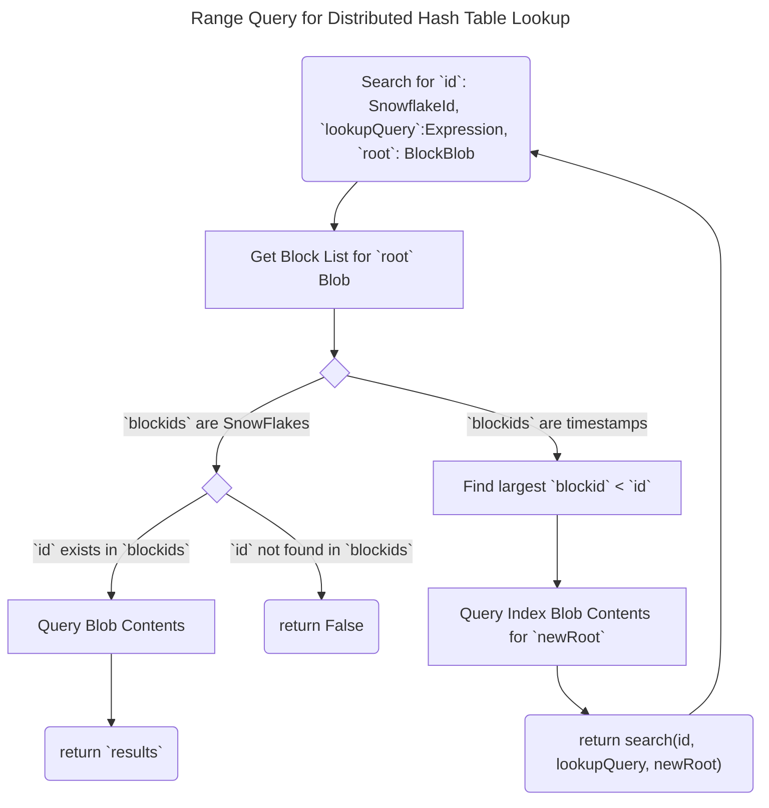

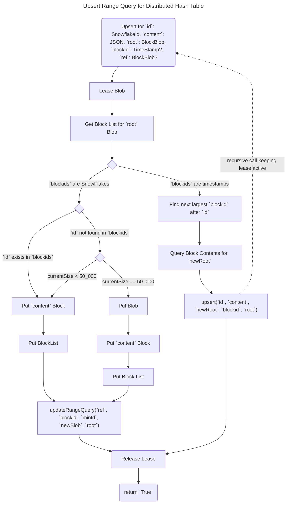

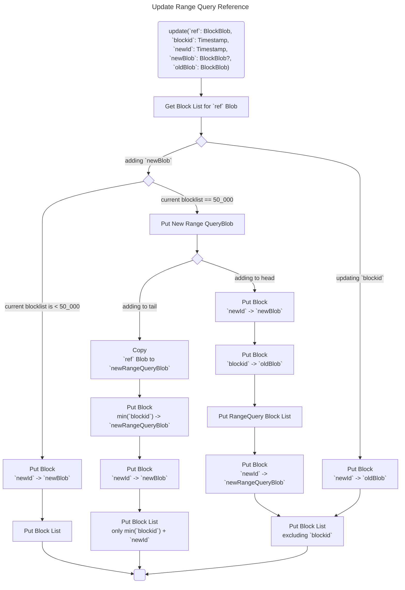

### Channel Watcher Worker

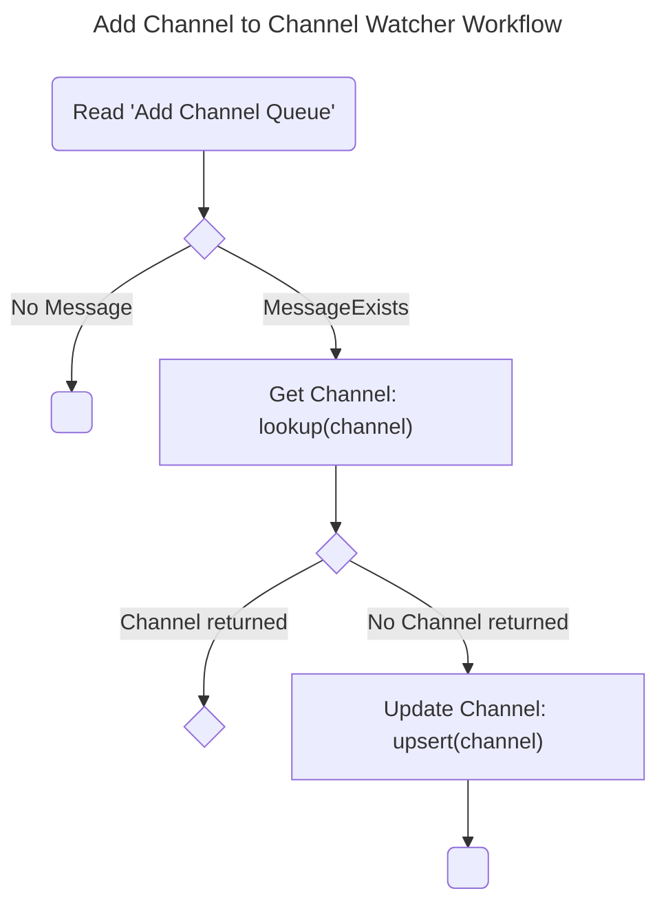

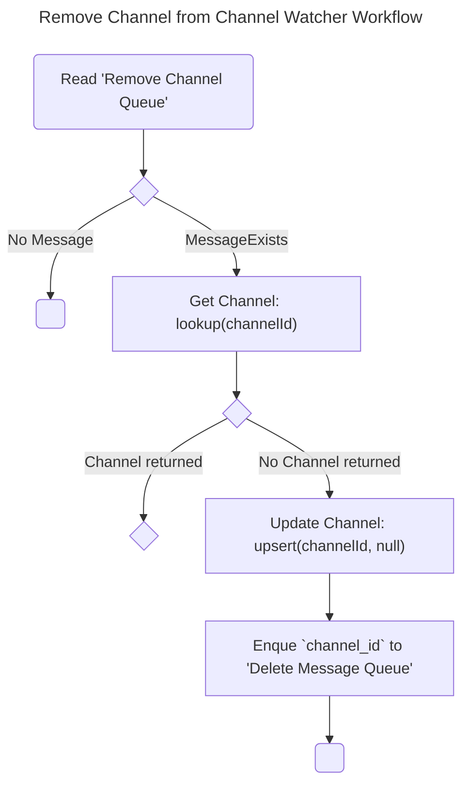

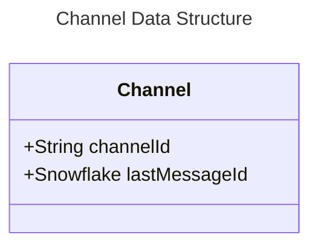

### New Message Worker

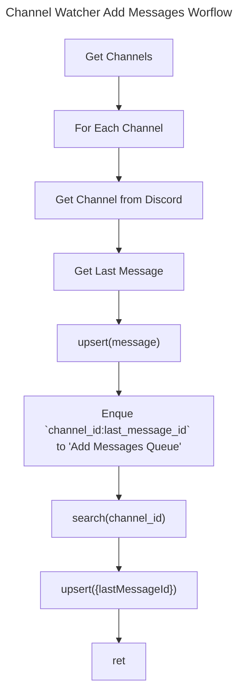

### Delete Message Worker

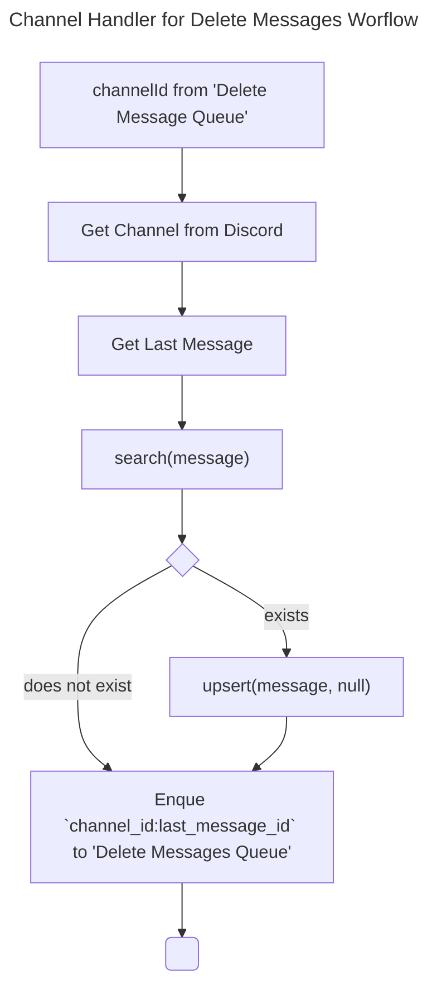

### Process Message Worker

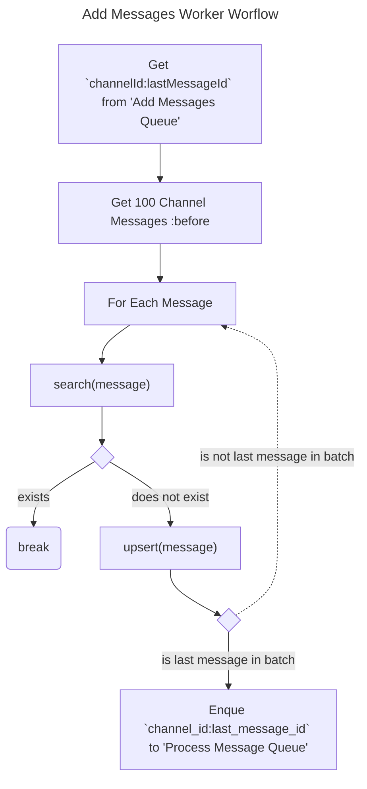

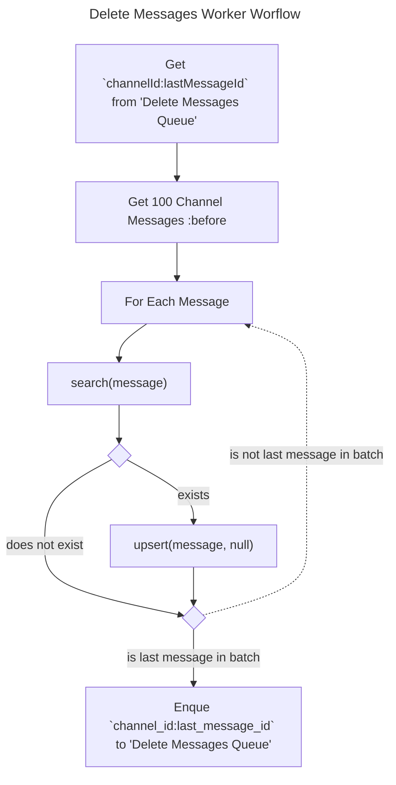

### Update Message Worker

> [!NOTE]
> Individual messages which need to be deleted or edited will require to be manually flagged in the front end, as the Discord Audit Log does not provide insights into all Message Delete and Edit events.

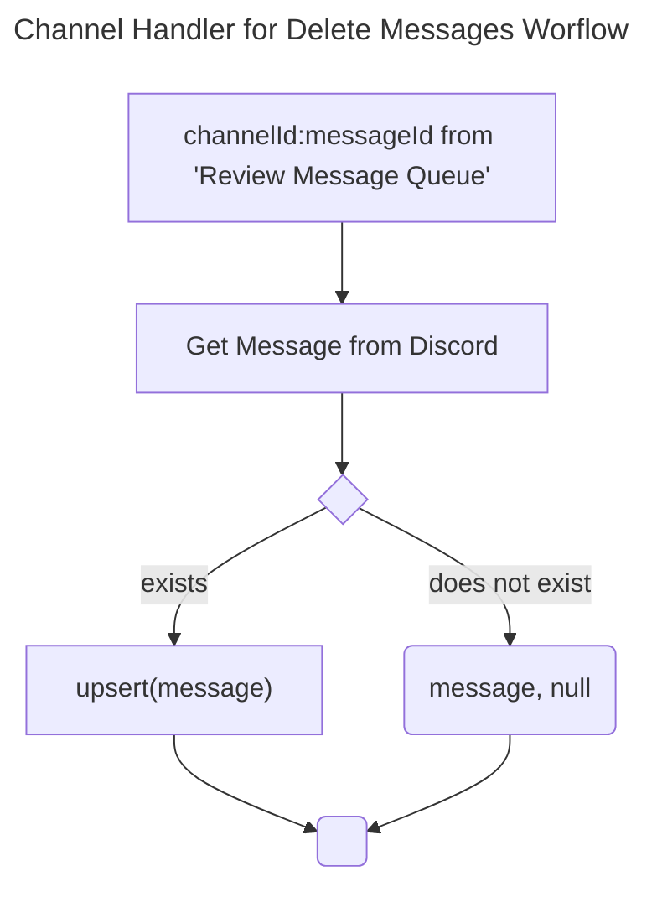

### Storage Tier Worker

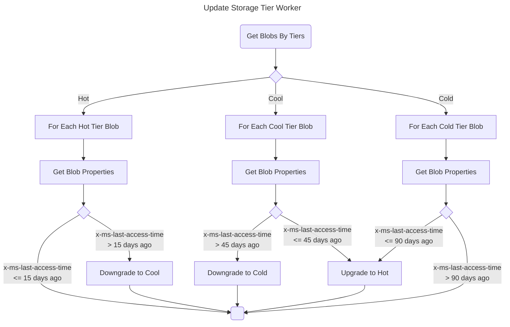
